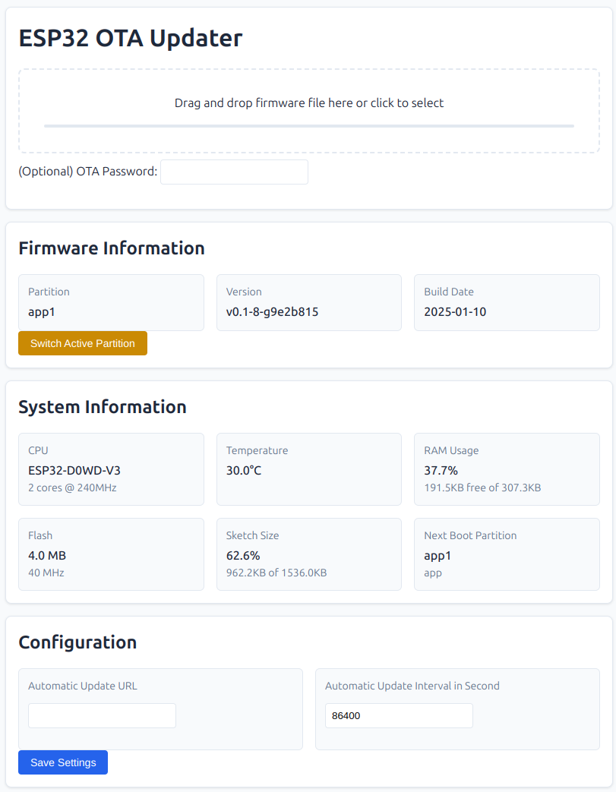

# ESP32 OTA Update Manager 

This OTA (Over-The-Air) Update Manager runs on your ESP32 and provides you a Webinterface to upload new firmware versions.
In addition, you can configure a remote url to automatically update your IoT devices from a remote source.

## Why?

Because I was bored and wanted to implement it myself.

## Focus of this Project

It is only made and tested it on my ESP32 Microcontroller.

## How is it working?

1) If a Network connection exists, the code tries to load a manifest file from a remote webserver.

2) If the remote server provides a newer version, an automatic update of the device will be executed.

3) If you do not provide a URL, you can use the Webinterface attached to your ESPAsyncWebserver to upload a firmware.

## Installation

Add the following lines to your program code:

```
#include "otawebupdater.h"

void setup() {
  OtaWebUpdater.setBaseUrl(OTA_BASE_URL);        // Set the OTA Base URL for automatic updates
  OtaWebUpdater.setFirmware(__DATE__, '1.0.0');  // Set the current firmware version
  OtaWebUpdater.startBackgroundTask();           // Run the background task to check for updates
  OtaWebUpdater.attachWebServer(&webServer);     // Attach our API to the Webserver
  OtaWebUpdater.attachUI();                      // Attach the UI to the Webserver
}
void loop() {
  // Do not continue regular operation as long as a OTA is running
  // Reason: Background workload can cause upgrade issues that we want to avoid!
  if (otaWebUpdater->otaIsRunning) { yield(); delay(50); return; };
}
```

## What do I need to do to access it?

If you want to use this OTA Update Manager, you can access the UI at `/ota`!
The UI route is only loaded to `/ota` if you execute `attachUI()` inside your script.



Without the UI, you can only run as a background task to update from a remote URL.
This is best for IoT devices that you want to update without any user interaction.

## IoT Automatic Update

To enable automatic remote updates, you need to create a json file on a webserver.
Add `OtaWebUpdater.setBaseUrl("http://yourserver.local");` to your code `setup()` routine.

The device will then try to find a new version every 24 hours.
You can change the interval using `setVersionCheckInterval(minutes)` if you want to change this.

Create a `current-version.json` on your webserver that contains the information about the latest image.

```
{
    "revision": "v1.0.0",
    "date": "2025-01-12"
}
```

If the date is newer than the current running build, an automatic update will be executed.
Make sure that you provide a `littlefs.bin` and a `firmware.bin` on the same URL to be installed.

Please let me know if you need a more advanced firmware installation process and feel free to provide a patch.
For my personal needs this is good enough to update all my devices automatically.

## Dependencies

This OTA Update Manager depends on some external libraries to provide the functionality.
These are:

* Arduino 
* Preferences
* ArduinoJson

# License

esp32-ota-update-manager (c) by Martin Verges.

This project is licensed under a Creative Commons Attribution-NonCommercial-ShareAlike 4.0 International License.

You should have received a copy of the license along with this work.
If not, see <http://creativecommons.org/licenses/by-nc-sa/4.0/>.

## Commercial Licenses 

If you want to use this software on a comercial product, you can get an commercial license on request.
